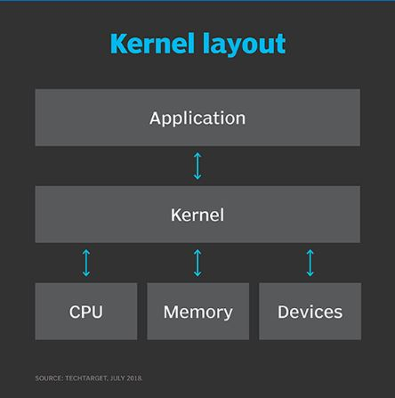
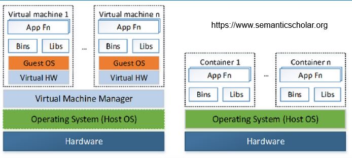
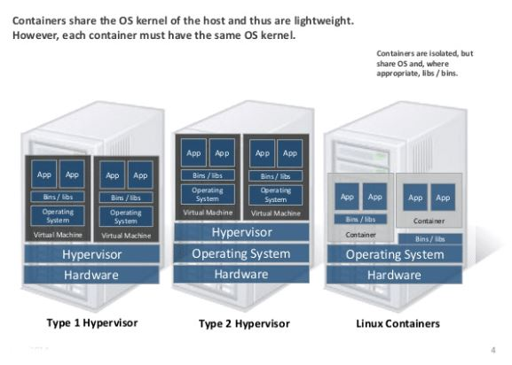
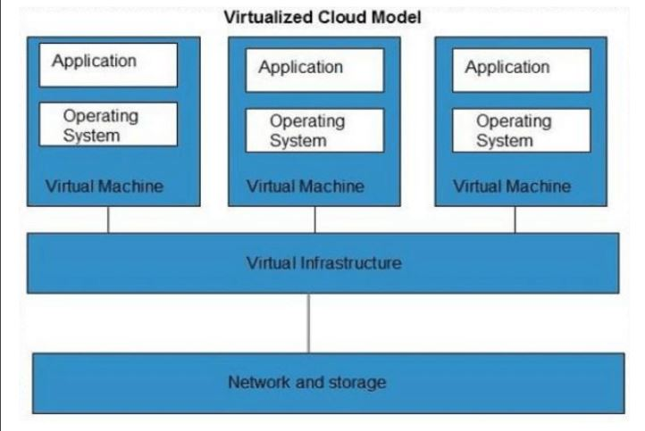
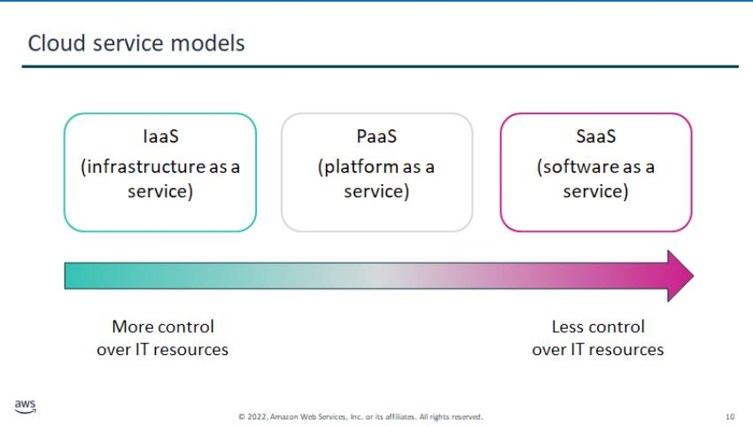
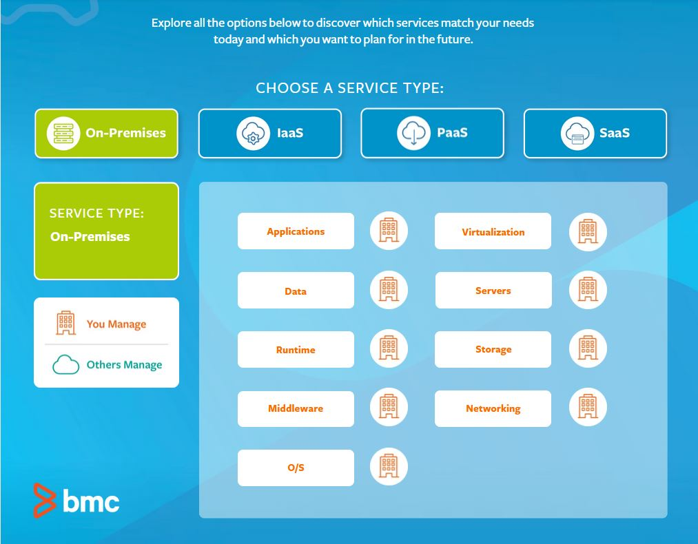
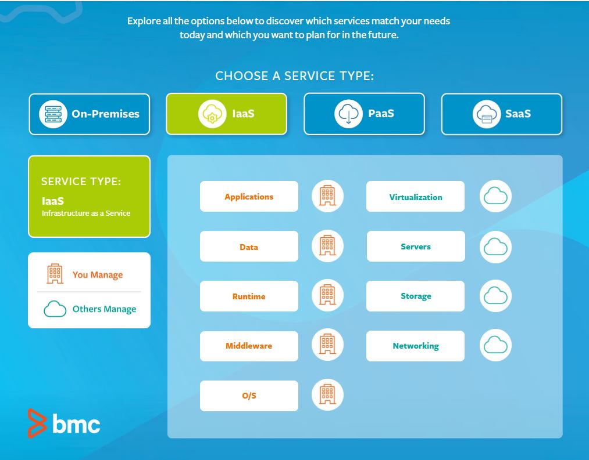
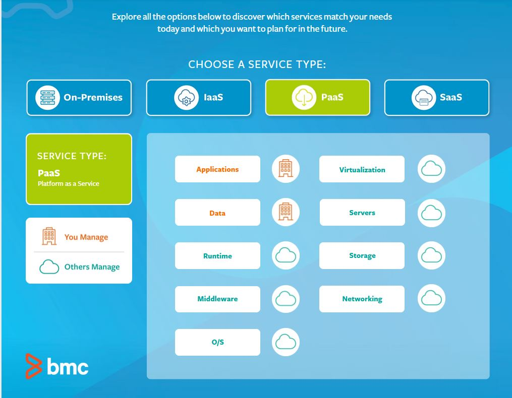
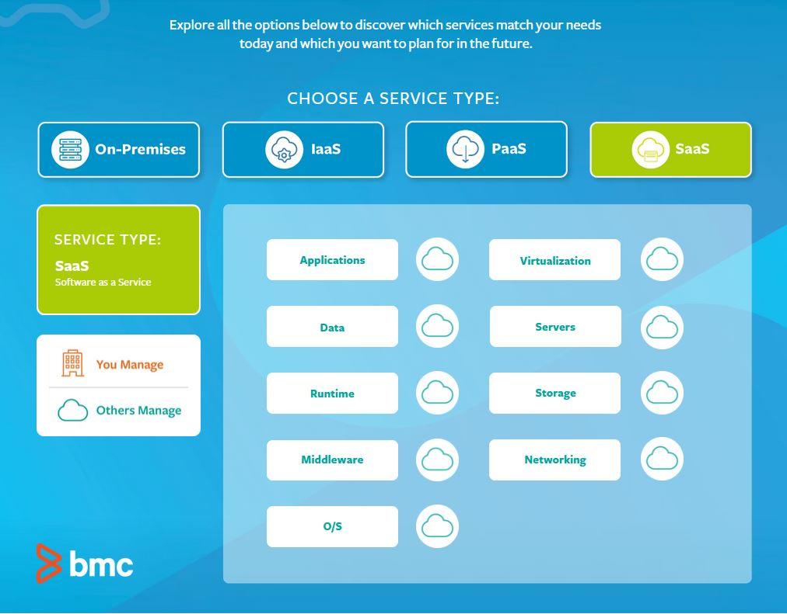
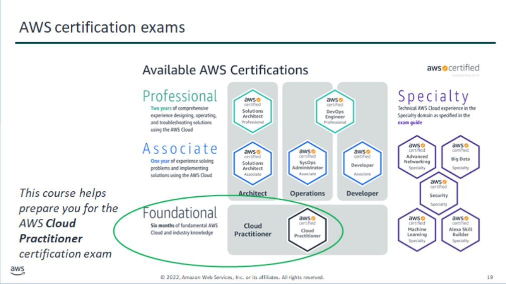

# Cloud Foundations

## Virtualization

What is a hypervisor?
A hypervisor, also known as a virtual machine monitor or VMM, is software that creates and runs virtual machines (VMs). A hypervisor allows one host computer to support multiple guest VMs by virtually sharing its resources, such as memory and processing.
https://www.vmware.com

### Kernel
The kernel is a computer program at the core of a computer's operating system and generally has complete control over everything in the system. It is the portion of the operating system code that is always resident in memory and facilitates interactions between hardware and software components.

### VMs versus Containers

## The term cloud?

Distributed computing when diagrammed cloud of services.

In the 1960s and 70s, IBM, DEC, and others started the initial concepts of time-sharing computing resources to increase efficiency of the hardware.

In the early to mid 1990s, Apple and Compaq were both using the term cloud.  Cloud was linked to the concept of distributed computing.  

In 1999, Salesforce became the first company to offer applications over the internet, heralding the arrival of Software as a Service.  By the mid 1990s, the term “the cloud” was being used in reference to this space of Internet services reachable by anywhere with Internet connection. Soon Google and Microsoft were racing to build more and more market share of this virtual environment.*

Suddenly, the cloud was everywhere and the expansion of PaaS (Platform-as-a-Service), SaaS, and IaaS (Infrastructure-as-a-Service) became a brand new industry with its offshoot, the cyber-security enterprise.
* https://solved.scality.com/solved/the-history-of-cloud-computing/

## AWS and Google
Wikipedia:  In July 2002, Amazon created subsidiary Amazon Web Services, with the goal to "enable developers to build innovative and entrepreneurial applications on their own." In March 2006 Amazon introduced its Simple Storage Service (S3), followed by Elastic Compute Cloud (EC2) in August of the same year. These products pioneered the usage of server virtualization to deliver IaaS at a cheaper and on-demand pricing basis.

In April 2008, Google released the beta version of Google App Engine. The App Engine was a PaaS (one of the first of its kind) which provided fully maintained infrastructure and a deployment platform for users to create web applications using common languages/technologies such as Python, Node.js and PHP. The goal was to eliminate the need for some administrative tasks typical of an IaaS model, while creating a platform where users could easily deploy such applications and scale them to demand.

## Microsoft Enters

In February 2010, Microsoft released Microsoft Azure, which was announced in October 2008.

In July 2010, Rackspace Hosting and NASA jointly launched an open-source cloud-software initiative known as OpenStack. The OpenStack project intended to help organizations offering cloud-computing services running on standard hardware. The early code came from NASA's Nebula platform as well as from Rackspace's Cloud Files platform. As an open-source offering and along with other open-source solutions such as CloudStack, Ganeti, and OpenNebula, it has attracted attention by several key communities.

On March 1, 2011, IBM announced the IBM SmartCloud framework to support Smarter Planet. Among the various components of the Smarter Computing foundation, cloud computing is a critical part.

On June 7, 2012, Oracle announced the Oracle Cloud. This cloud offering is poised to be the first to provide users with access to an integrated set of IT solutions, including the Applications (SaaS), Platform (PaaS), and Infrastructure (IaaS) layers.

In May 2012, Google Compute Engine was released in preview, before being rolled out into General Availability in December 2013.

In 2019, Linux was the most common OS used on Microsoft Azure.

In December 2019, Amazon announced AWS Outposts, which is a fully managed service that extends AWS infrastructure, AWS services, APIs, and tools to virtually any customer datacenter, co-location space, or on-premises facility for a truly consistent hybrid experience.

## Linux and open source movement

Microsoft domination in the desktop and server platform market, and their ecosystem (.NET) as a proprietary systems

Market moved towards open source and Linux.

In 2014, Microsoft CEO Satya Nadella said, "Microsoft loves Linux."

## Cloud Services

## The documentation

https://docs.aws.amazon.com/

### After completing this module, you should be able to:

* Recognize the purpose of the AWS Academy Cloud Foundations course
* Recognize the course structure
* Recognize the AWS certification process
* Navigate the AWS documentation website

## Course Outline

* Module 1: Cloud Concepts Overview
* Module 2: Cloud Economics and Billing
* Module 3: AWS Global Infrastructure Overview
* Module 4: AWS Cloud Security
* Module 5: Networking and Content Delivery
* Module 6: Compute
* Module 7: Storage
* Module 8: Databases
* Module 9: Cloud Architecture
* Module 10: Automatic Scaling and Monitoring

## Sample Questions

### AWS Certified Cloud Practitioner – Foundational Sample Exam Questions
© 2018, Amazon Web Services, Inc. or its affiliates. All rights reserved
1) Why is AWS more economical than traditional data centers for applications with varying compute
Workloads? 
    1) Amazon Elastic Compute Cloud (Amazon EC2) costs are billed on a monthly basis. 
    1) Customers retain full administrative access to their Amazon EC2 instances. 
    1) Amazon EC2 instances can be launched on-demand when needed.
    1) Customers can permanently run enough instances to handle peak workloads.

Answer: 
Amazon EC2 instances can be launched on-demand when needed.

2) Which AWS service would simplify migration of a database to AWS? 
    1) AWS Storage Gateway
    1) AWS Database Migration Service (AWS DMS)
    1) Amazon Elastic Compute Cloud (Amazon EC2) 
    1) Amazon AppStream 2.0

Answer: 
AWS Database Migration Service (AWS DMS)

   

3) Which AWS offering enables customers to find, buy, and immediately start using software solutions in
their AWS environment? 
    1) AWS Config 
    2) AWS OpsWorks 
    3) AWS SDK 
    4) AWS Marketplace

Answer: 
AWS Marketplace

   

4) Which AWS networking service enables a company to create a virtual network within AWS? 
    1) AWS Config
    2) Amazon Route 53 
    3) AWS Direct Connect 
    4) Amazon Virtual Private Cloud (Amazon VPC)

Answer: 
Amazon Virtual Private Cloud (Amazon VPC)

 

5) Which of the following is AWS's responsibility under the AWS shared responsibility model?
    1) Configuring third-party applications 
    2) Maintaining physical hardware
    3) Securing application access and data 
    4) Managing custom Amazon Machine Images (AMIs)

Answer: 
Maintaining physical hardware

 

6) Which component of AWS global infrastructure does Amazon CloudFront use to ensure low-latency
Delivery? 
    1) AWS Regions 
    2) AWS edge locations 
    3) AWS Availability Zones 
    4) Amazon Virtual Private Cloud (Amazon VPC)

Answer: 
AWS edge locations 

 

7) How would a system administrator add an additional layer of login security to a user's AWS
Management Console? 
    1) Use AWS Cloud Directory 
    1) Audit AWS Identity and Access Management (IAM) roles
    1) Enable Multi-Factor Authentication
    1) Enable AWS CloudTrail

Answer: 
Enable Multi-Factor Authentication 

 
     
8) Which service can identify the user that made the API call when an Amazon Elastic Compute Cloud
(Amazon EC2) instance is terminated? 
    1) Amazon CloudWatch 
    1) AWS CloudTrail
    1) AWS X-Ray 
    1) AWS Identity and Access Management (AWS IAM)

Answer: 
AWS CloudTrail

 

## AWS Academy Course Material

https://awsacademy.instructure.com/courses/57214/modules

## Scavenger Hunt

Question #1: What guides and references exist for the Amazon EC2 service?

        
https://docs.aws.amazon.com/ec2/?id=docs_gateway

* User Guides for Linux and Windows
* API Reference
* AWS CLI Reference
* EC2 Instance Connect Reference
* User Guide for Auto Scaling
* VM Import/Export User Guide

Question #2: Can you find the documentation that describes how to create an Amazon S3 bucket?

        
https://docs.aws.amazon.com/AmazonS3/latest/gsg/CreatingABucket.html

* From https://docs.aws.amazon.com/ click **S3**
* Click the **Getting Started Guide**
* Click **Create a Bucket**

Question #3: Can you find a one-sentence summary of the AWS Cloud9 service?

https://docs.aws.amazon.com/cloud9/?id=docs_gateway

* AWS Cloud9 is a cloud-based integrated development environment (IDE) that you use to write, run, and debug code.

Question #4: Which programming languages does the AWS Lambda service API support?

https://docs.aws.amazon.com/lambda/latest/dg/gettingstarted-tools.html 

* From the main AWS Documentation page, click the **AWS Lambda** link
* Click the **API Reference** link
* Click **Getting Started** > Tools to find a table that lists the following languages: _Node.js_, _Java_, _C#_, _Python_, _Ruby_, _Go_, and _PowerShell_

Question #5: Find the tutorial that describes how to run a serverless Hello World application, then scroll through the documented steps. What two AWS services does the tutorial have you use?

https://aws.amazon.com/getting-started/tutorials/run-serverless-code/

* From the main AWS Documentation page, click **Tutorials and Projects**
* In the **Websites & Web Apps** area, click the tutorial.
* The tutorial has you use _AWS Lambda_ and _Amazon CloudWatch_

